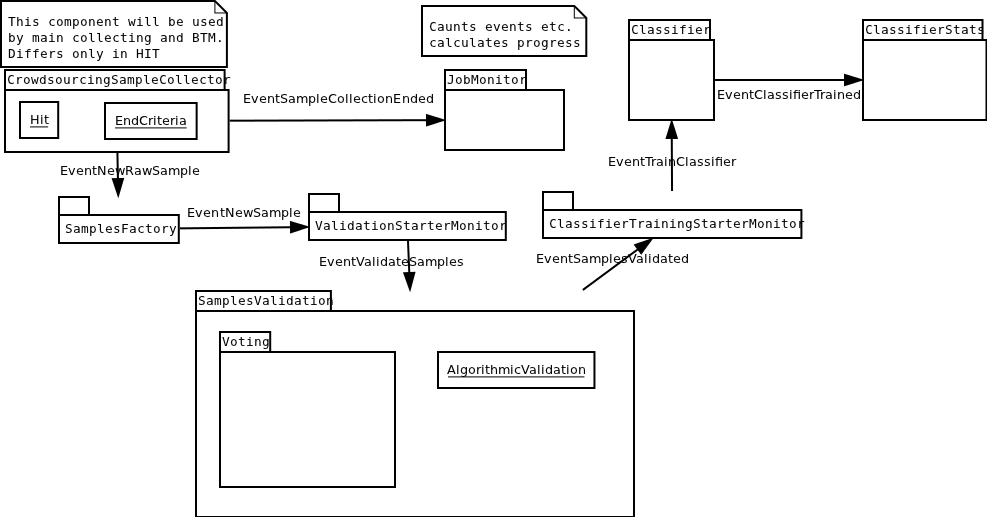
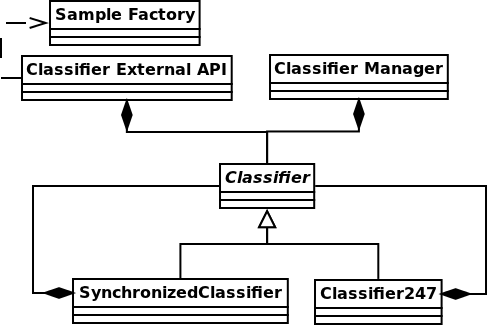

URLAnnotator architecture proposal
==================================

Overall view
------------

This diagram presents general flow of the data

**TrainingSetCreator** generates mainly two events:

- TrainingSetCompleated
- TrainingSetUpdated

Simple event flow diagram
-------------------------

Django Apps
-----------

- flow_control

  - event_system

- classification

  - classifier
  - classifier_statistics

- sample_gathering

  - training_set_creation
  - beat_the_machine
  - crowdsourcing_sample_gathering

- sample_factory

- crowdsourcing

  - hit_definition/template

    - voting
    - url entering

  - sample_gathering
  - sample and workers quality

- tagasauris_api_client

  - job/results monitoring
  - hit creation etc.

Database models
===============

To minimalise overhead we decide to make access to DB non event based.
**Think if this will be thread safe?!**

Job
---

- title
- owner
- description
- expected cost (maybe with distribution on separate parts)
- classifier parameters (like to use Google Prediction API or anything else)
- golden data - sample urls matching description provided by job creator
- status
- progress
- amount of URLs we want to collect ?
- additional parameters ?

Sample
------

- Job
- url
- text / content of the website
- screen-shot (probably some url address to S3)
- label / None

Optionally also:

- source - normal_collecting / BTM etc.
- added_by - Worker
- added_on - date it was added

Worker
------

- name etc.
- estimated quality

WorkerQualityVotes
------------------

- worker
- sample
- vote/label ('correct', 'incorrect')
- added_on

GoldSamples
-------------

- Sample
- vote/label

Classifier
----------

- Job
- type (like "Google API", etc.)
- parameters

Statistics
----------

- stores some data about classifier performance
- date at which this statistics were calculated

BeatTheMachineSamples
---------------------
Subclass of **Sample**?

- expected_output
- classifier_output
- error_ratio (maybe 1 - classifierProbab(sample_cls = expected_output) ?)

Component specification
=======================

SampleFactory
-------------

**SampleFactor** will be used after URLGathering stage and in Classifier External API.

**QUESTION - do we need screenshot for classification? This might be waste of quota**

This object given the URL will create **Sample**. It will delegate two tasks using celery:

- getting text content of the website
- making screen-shot of the website, uploading it somewhere (S3?), returning its url

They should be done in parallel.
We can do this tasks using external API or just implement.

If at any point api will fail we would like to retry it with exponential back-off.

QUESTION: If at some point website will be broken we should notice this somehow and skip using it?

Classifier
----------
Class abstract with methods (sample is of class *Sample*):

- new(description, classes)
- train(samples)
- update(samples) (optional - implemented with train if not provided by normal implementation)
- classify(sample) -> class
- classify_with_info(sample) -> dict with class and probability distribution over classes etc.

Implemented with:

- Google Prediction API
- some simple test classifier? (Orange library?)

Important notes
~~~~~~~~~~~~~~~
It should be implemented so that we could run multiple classify methods at the same time (thread-safety).

SynchronisedClassifier (optional due to Classifier247)
~~~~~~~~~~~~~~~~~~~~~~~~~~~~~~~~~~~~~~~~~~~~~~~~~~~~~~
This class will be a wrapper around Classifier to make it synchronized in read/write kind:

- many calls can be done on *classify* methods at the same time
- only one *train* method can be called at the time and at this point no *classify* can be run/called

It should work that way:

- we allow *classify* normally
- when *train* comes we doesn't allow any *classify* and wait until all *classify* are gone
- do *train* and be gone

Optionally we could prioritize *train* to always push it to be done before any *classify* but this shouldn't be needed and could lead to starvation of *classify*

Classifier247
~~~~~~~~~~~~~

This classifier has two inner classifiers. Always one of them is providing methods related to classification. When trained we train this backup classifier and when ready it will be swapped with the one that is responsible for classification.

Notes:

- It must have lock on training classifier (we protect data, not methods).
- there is a lock on classification classifier with model readers-writer - writer does only swapping between classifiers

**As someone noticed - this might be overkill. We could also create new one instead of using previous and swap with it.**

ClassifierExternalApi
~~~~~~~~~~~~~~~~~~~~~

This will use **SynchronizedClassifier** and **SampleFactory**.
Probably this will be done using REST.
We will need to make locking queries with some timeout so that we can return with status "Currently unavailable - try again in few minutes"

What can go wrong:
~~~~~~~~~~~~~~~~~~

- quota exceeded - we throw exception and depending on situation handle it properly. When we are at stage of collecting samples for training we should buffer them. If we are classifying for user some of his samples we will just present to him this information.
- Internal fail: like out of memory, dead service (when using Google Prediction) or just some crash due to some internal bug etc.

Classifier based on Google Prediction API
~~~~~~~~~~~~~~~~~~~~~~~~~~~~~~~~~~~~~~~~~

We will have to use Google Cloud Storage.
Good source of information can be found:
https://developers.google.com/prediction/docs/developer-guide
I'm still not sure if we can use long texts as samples...

UML diagram
~~~~~~~~~~~

Caching note
~~~~~~~~~~~~

We could cache classifier classification requests. We will have to invalidate them as classifier gets retrained.

ClassifierManager/Factory
-------------------------

This object is responsible for creating **Classifier** when new job is created based on its parameters. It also creates **ClassifierEventListener** and plugs it to proper event bus and just created classifier.

TagasaurisJobMonitor
--------------------

This component will be responsible for checking Tagasauris whether:

- given job has finished
- some job results "arrived"

and makes proper event on such situations.

It also have to store mapping between Tagasauris job id's and our system ids.

Parameters
~~~~~~~~~~

How often do we check and propagate changes.

TrainingSamplesCollector
------------------------

This will use Tagasauris to collect samples and verify them also with Tagasauris and some qualityAlgorithm.

As input it takes job description be able to create proper Tagasauris tasks.

SamplesCollector
----------------

This component is responsible for collecting samples that after validation will be used to train classifier.

.. image:: sample_collector.png

That way collected samples will be processed in SampleFactory

TODO NOTE maybe better name is with Simple? because we would like to distinguish it from **Sample** in terms of our DB.

Useful small elements
---------------------

- exception QuotaLimitExceeded or/and event

Crowdsourcing package
=====================

This package provides tools that we will use in few parts of this system

**CrowdsourcingProgressMonitor** sends events about any progress.

SamplesValidation
=================

We will make this work in two stages.

Voting
------

We will create voting job on Tagasauris and try to collect votes in chunks.
As we get some samples we propagate *EventSomeSamplesVoted*.

Resulting votes are in form of WorkerQualityVotes - every entry contains sample, worker and label correct/incorrect/broken.

AlgorithmicValidation
---------------------
After we get event *SamplesPartialyValidated* we get samples ALL samples from HumanValidation and run given algorithm on them.

At this point we can use:

- majority voting
- DS
- GAL
- DSaS

Result will consist of two elements:

- estimated workers quality (even for majority voting we can estimate this)
- estimated samples labels

Samples with labels are proper input to classifier

BeatTheMahine
-------------

This is just module **SamplesCollector** with **Hit:TextualInput** given different:

- **Schema/Template**
- **EndCriteria**

WorkerBlockingMechanics
-----------------------

It will require two DB tables:

- WorkersJobBlocked where we keep pairs (Worker, Job) which means that Worker is not allowed to participate in Job
- GloballyBlockedWorkers just list of workers which are blocked. This table is superior to previous so that if worker is in this table than we don't check the other one

Listens on events:

- EventBlockWorkerInJob(worker, job)
- EventBlockGloballyWorker(worker)
- EventWorkerGotContract(worker, job, contract_id) - if matches than sends *EventCancelWorkerContract(contract_id)*

Notes
=====

Samples
-------
We have few kind of samples:

- RawSample - url, source (BTM, normal), label/None
- HitSample - url, picture
- ClassifierSample - url, text

Sample that we use in our system has all fields that mentioned above have

TODO's
======

General TODOS
-------------

- Storage of training set and choosing samples ...

Readers/Writer access
---------------------

There are some parts where we would like to have such synchronization or maybe copying.
Problem is that we have evolving data structure and we would like to freeze it for the moment ..

- TrainingSamplesStorage
- Classifier
- WorkerVotesStorage

Implementation notes:
=====================

- Module with only Managers close to Events ...

Questions
=========

- Scope of worker blocking?
- How to deal with "Readers/Writer access"
- smartly parts listen on events or we have some flow control which sends proper events as reaction to others?

Optional parts - mostly not finished
====================================

Revenue
-------
Defines how much do we pay users for their jobs.

*RevenueDefinition* is mapping from (**WorkerAction**, **result**) into **Money**?
This should be stored in some csv or json file so that it can be configured.

BeatTheMachineRevenueMechanics
~~~~~~~~~~~~~~~~~~~~~~~~~~~~~~
Defines how much revenue will be given to worker for proving given sample. Components:

- **RevenueType** - describes whether we are satisfied with sample provided by user or not. Examples:

 - TP or TN - no error - useless sample for us
 - FP
 - FN
 - low confidence but correct

 etc

-
- RevenueDefinition - mapping from

method *reporterRevenue(classifier_difference ...)*
returns payback or

OLD - Needs checking what is still actual
=========================================

Core components/services:
-------------------------

- *JobPoster* - Place which creates *Job* s with their descriptions, manages accounts, their balances etc.

- *TrainingDataCollector* - component that given description collects matching samples (in this case urls). It will do this by using crowdsourcing platform like oDesk

- *DataValidator* - it is mechanism that takes given url and label that it was assigned and checks whether this label is right. It will be used on data generated by *TrainingDataCollector* and potentially to measure *classifier* performance

- *Classifier* - binary classifier which will decide whether website given by url matches description attached to this *Job*

- *BeatTheMachine* - mechanism for constant validation of classifier with some new data - using crowdsourcing

EventBus
========

We might use at this point some existing library. Currently there are some assumptions that we hope that will work.

Event
-----
**Event** contains:

- job_id
- type
- data

EventListener
-------------

Every object that is listening on a bus implements **EventListener** interface (I know this is not java - name is convenient) which has:

- method *matches(event)*
- notify(event)

Important Events
----------------

Global:

- NewJobStarted
- JobFinished

Job related:

- CollectedSomeTrainingSamples
- TrainingSamplesCollection{Started/Ended} (start is to make other components prepare for taking this samples - in this case is Validator)
- ValidatedSomeSamples
- ..TODO..
- Classifier{Created/Updated}

Elements plugged into the *EventBus* (described later):

- ClassificatorFactory(or Manager?)
- SamplesCollectionManager
- SamplesValidationManager
- BeatTheMachineStartManager

and also this elements registered on all kind of events:

- BusLogger
- BusErrorReporter (to sent errors to Sentry-like service, email etc)

Events handling and flow
------------------------

EventCreateNewJob
~~~~~~~~~~~~~~~~~

- **JobFactoryManager** passes job details to **JobFactory** and it creates **Job** and its **JobManager**. Afterwards it pushes **EventNewJobCreated**.

EventNewJobCreated
~~~~~~~~~~~~~~~~~~

Mostly we create Factories at this point.

It looks like this:

     **A_FactoryManager** creates **A_Manager**, pases B details to **A_Factory** which creates **A** and plugs it into **A_Manager**. Afterwards it pushes *EventNew_A_Created*

In this fashion we work with:

- **ClassifierFactoryManager** with classifier details passed
- **SampleFactoriesFactoryManager** with job details

* QualityAlgorithm
* SampleCollector

- **BeatTheMachineAutomaticStarterFactoryManager** checks if given job want to use automatic start of **BeatTheMachine** and if so creates **BeatTheMachineAutomaticStarterManager** and passes proper parameters to **BeatTheMachineAutomaticStarterFactory** which creates **BeatTheMachineAutomaticStarter** and plugs it into **BeatTheMachineAutomaticStarterManager**

- TODO XXX What else

EventNewSampleFactoryCreated, EventNewClassifierCreated, ...?
~~~~~~~~~~~~~~~~~~~~~~~~~~~~~~~~~~~~~~~~~~~~~~~~~~~~~~~~~~~~~

- **JobManager** - after seeing this events it changes Job status to ready and sends **EventJobReady**

EventJobStarted
~~~~~~~~~~~~~~~

- **TrainingSetCreatorManager** calls **TrainingSetCreator** to start collecting training samples.

EventTrainingSetUpdated
~~~~~~~~~~~~~~~~~~~~~~~

- **ClassifierManager** calls **Classifier** to update itself on new data. **ClassifierManager** afterwards pushes *EventClassifierUpdated*

EventTrainingSetCompleated
~~~~~~~~~~~~~~~~~~~~~~~~~~

- **JobManager** destroys **TrainingSetCreator** or does it destroys itself by unregistering from the bus?

NOTE:
Maybe this *EventTrainingSetCompleated* and *EventTrainingSetUpdated* should be the same type so that **ClassifierManager** would be registered on one of theme?

EventClassifierUpdated
~~~~~~~~~~~~~~~~~~~~~~

- **StatisticsCollector** collects stats and stores them in StatisticStorage, so that we could present some charts to the user.

